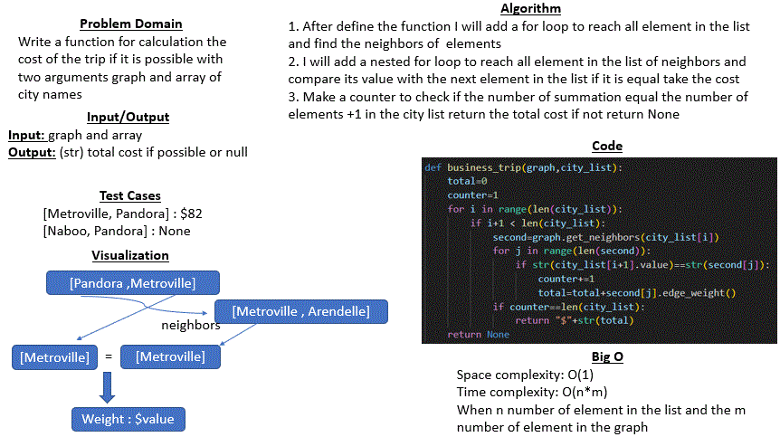

# Code challenge 37 : graph-business-trip
## Whiteboard Process
* ### graph business trip
     

## Approach & Efficiency
* In this challenge I used two for loop nested and if statement to make a specific conditions
* Big O :
    - Space complexity : O(1)
    - Time complexity : O(n*m) When n number of element in the list and the m number of element in the graph . 

## Solution 
Case 1 : 
* Input : [ Metroville, Pandora ]	
* Output : $82

Case 2 : 
* Input : [ Naboo, Pandora ]	
* Output : None
	

Case 3 : 
* Input : [ Arendelle, New Monstropolis, Naboo ]	
* Output : $115

Case 4 : 
* Input : [ Narnia, Arendelle, Naboo ]	
* Output : None