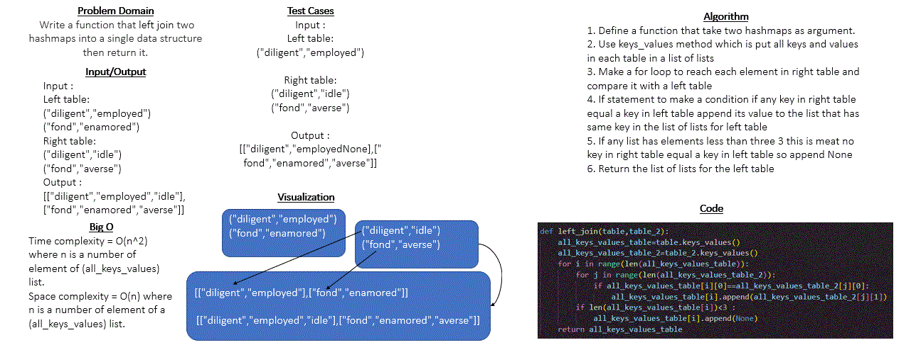

# Code challenge 33 : hashmap-left-join

## Whiteboard Process
* ### hashmap left join
     

## Approach & Efficiency
* In this challenge I used two for loop to reach for each element in the lists if statment to make a specific conditions

* Big O for all methods:
    - Time complexity = O(n^2) where n is a number of element of (all_keys_values) list
    - Space complexity = O(n) where n is a number of element of a (all_keys_values) list

## Solution 
First case (same keys order) : 
* Input :

    * left_table=HashTable()
    * left_table.set("diligent","employed")
    * left_table.set("fond","enamored")

    * right_table=HashTable()
    * right_table.set("diligent","idle")
    * right_table.set("fond","averse")
 
* Output : [ ["diligent","employed","idle"] , ["fond","enamored","averse"] ]

Second case (different keys order) : 
* Input :

    * left_table=HashTable()
    * left_table.set("fond","enamored")
    * left_table.set("diligent","employed")

    * right_table=HashTable()
    * right_table.set("diligent","idle")
    * right_table.set("fond","averse")
 
* Output : [ ["fond","enamored","averse"] , ["diligent","employed","idle"] ]

Third case (not found all keys) : 
* Input :

    * left_table=HashTable()
    * left_table.set("diligent","employed")
    * left_table.set("fond","enamored")
    * left_table.set("wrath","delight")

    * right_table=HashTable()
    * right_table.set("diligent","idle")
    * right_table.set("fond","averse")

    
* Output : [ ["diligent","employed","idle"] , ["fond","enamored","averse"] , ["wrath","delight",None] ]