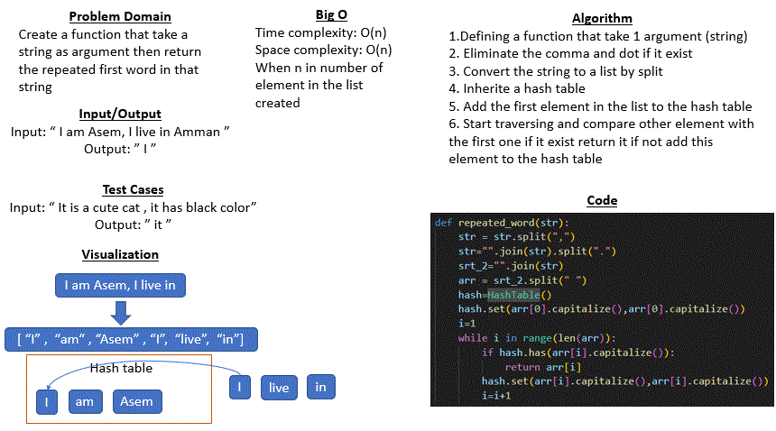

# Code challenge 31 : hashmap_repeated_word

## Whiteboard Process
* ### hashmap repeated word
     

## Approach & Efficiency
* In this challenge I use while loop to traverse in each node in lisr that has a split of string and if statment to make a specific conditions

* Big O for all methods:
    - Time complexity = O(n) where n is a number of element of a ceated list
    - Space complexity = O(n) where n is a number of element of a created list

## Solution 
string_one : 
* Input: "Once upon a time, there was a brave princess who..."
* Output: "a"

string_two : 
* Input: "It was the best of times, it was the worst of times, it was the age of wisdom, it was the age of foolishness, it was the epoch of belief, it was the epoch of incredulity, it was the season of Light, it was the season of Darkness, it was the spring of hope, it was the winter of despair, we had everything before us, we had nothing before us, we were all going direct to Heaven, we were all going direct the other way – in short, the period was so far like the present period, that some of its noisiest authorities insisted on its being received, for good or for evil, in the superlative degree of comparison only..."
* Output: "it"

string_three : 
* Input: "It was a queer, sultry summer, the summer they electrocuted the Rosenbergs, and I didn’t know what I was doing in New York..."
* Output: "summer"

