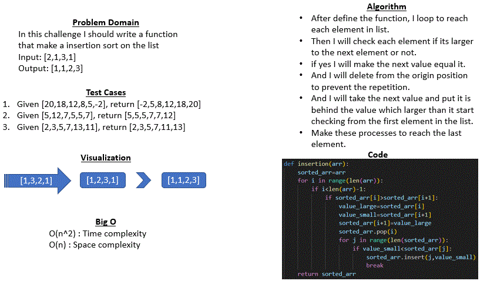

# Code Challenge 26 : Insertion Sort
## Whiteboard Process
* 
     

## Approach & Efficiency (for all methods)
* In this code I used a for loop to reach each element to each in the list and if statement to make a specific conditions

* Big O for all methods:
    - O (n^2): Time complexity
    - O (n): Space complexity

## Solution 
### Case 1 :
* reverse_sorted = [20,18,12,8,5,-2] : 
* [18, 20, 12, 8, 5, -2] : first change happened, after compair the first value with the second will make the fisrt one in the position of second one because it is larger than the second 

* [12, 18, 20, 8, 5, -2] : second change happened, after compair the second value with the third will make the second one in the position of third one because it is larger than the third, after that make another search to find the proper position for the third value here it put in the first because it is smaller the the first that existed.
* [8, 12, 18, 20, 5, -2] : third change happened with same process
* [5, 8, 12, 18, 20, -2] : fourth change happened
* [-2, 5, 8, 12, 18, 20] : last change happened

### Case 2 :
* few_uniques = [5,12,7,5,5,7] :
* [5, 12, 7, 5, 5, 7] : at first no change because the first element is smaller thar the second one

* [5, 7, 12, 5, 5, 7] : second change happened, after compair the second value with the third will make the second one in the position of third one because it is larger than the third 
* [5, 5, 7, 12, 5, 7] : third change happened
* [5, 5, 5, 7, 12, 7] : fourth change happened
* [5, 5, 5, 7, 7, 12] : last change happened

### Case 3 :
* nearly_sorted = [2,3,5,7,13,11] : 
* [2, 3, 5, 7, 13, 11]
* [2, 3, 5, 7, 13, 11]
* [2, 3, 5, 7, 13, 11]
* [2, 3, 5, 7, 13, 11]
* [2, 3, 5, 7, 13, 11]
* [2, 3, 5, 7, 11, 13] : in all last steps the list had no changes beacause it is sorted until reach to 13 it is make a change to make it all sorted.

