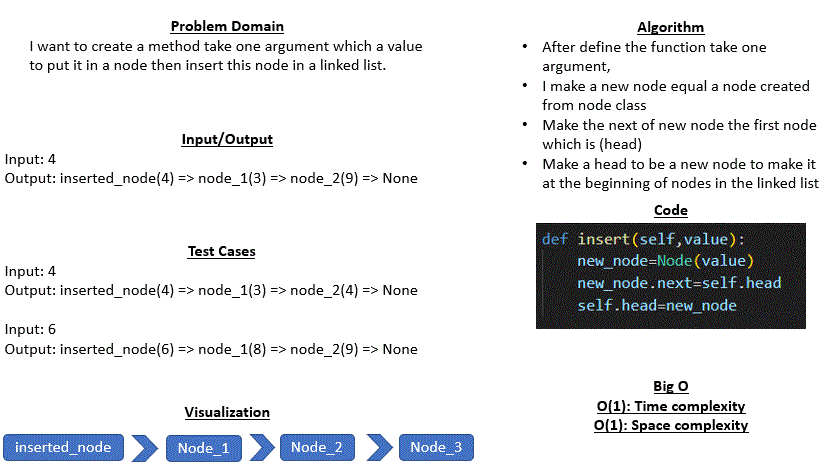

# Code Challenge 05 : linked-list
## Whiteboard Process
* 

## Approach & Efficiency
* In this code I just asign a value for varial so it's efficiency on the highest O(1) time complexity

* Big O :
    - O (1): Time complexity
    - O (1): Space complexity

## Solution 
Example : 
* Input: 4  
Output: inserted_node(4) => node_1(3) => node_2(8) => None

