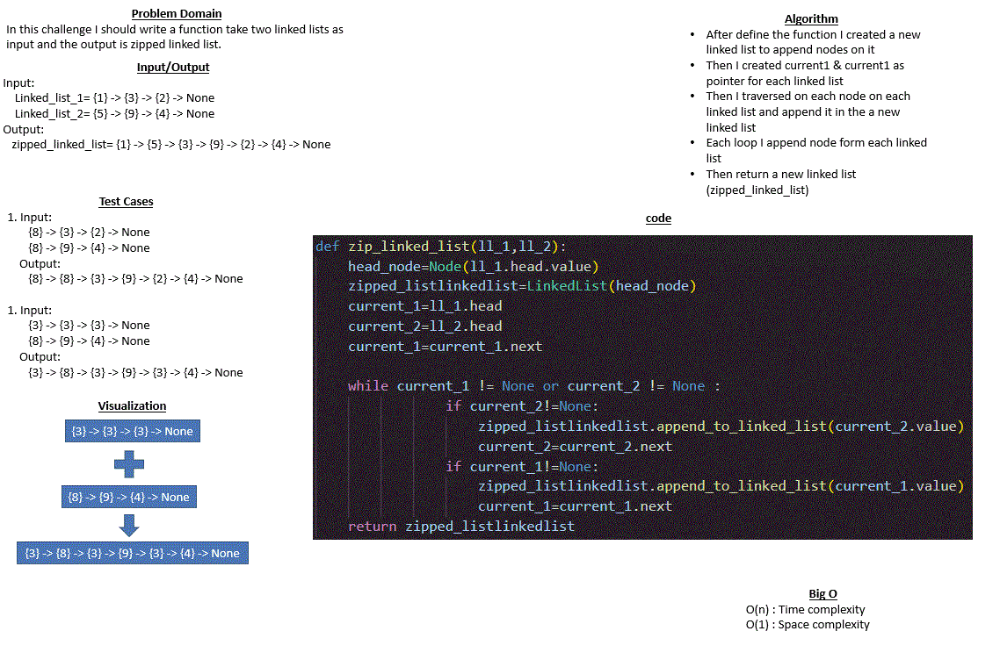

# Code Challenge 08 : linked-list-zip
## Whiteboard Process

## Approach & Efficiency (for all methods)
* In this code I used a while loop to traverse between nodes and I used if statement to make a specific conditions

* Big O :
    - O (n): Time complexity
    - O (1): Space complexity

## Solution 
Example : 
* input :  
Linked_list_1 = {1} -> {3} -> {2} -> None 
Linked_list_2 = {5} -> {9} -> {4} -> None 

* Output: 
 zipped_linked_list = {1} -> {5} -> {3} -> {9} -> {2} -> {4} -> None

