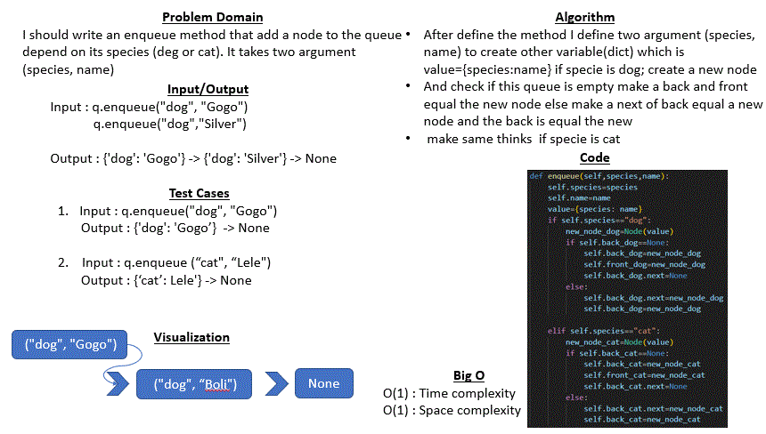
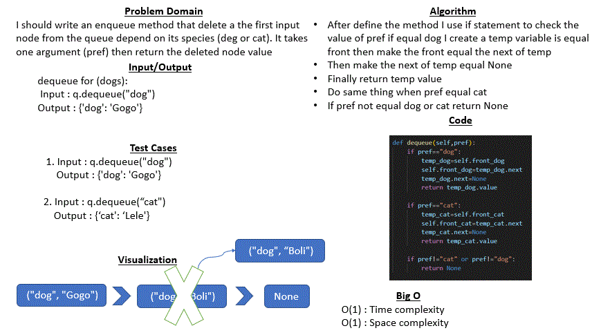

# Code challenge 12 : stack-queue-animal-shelter
## Whiteboard Process
* ### enqueue method
     

* ### dequeue method
     

## Approach & Efficiency
* In this challenge I used if statement to make a specific  condition I did not need to make traverasing so time complexity = O(1).
* Big O: time complexity = O(1)
* Big O: space complexity = O(1)
## Solution

* queue

        enqueue for (dogs):
        q=AnimalShelter()
        q.enqueue("dog","Gogo")
        q.enqueue("dog","Silver")
        q:{'dog': 'Gogo'} -> {'dog': 'Silver'} -> None

        enqueue for (cats):
        q=AnimalShelter()
        q.enqueue("cat","Lele")
        q.enqueue("cat","caty")
        q:{'cat': 'Lele'} -> {'cat': 'caty'} -> None

        dequeue for (dogs): 
        q.dequeue("dog") : {'dog': 'Gogo'}

        dequeue for (cats): 
        q.dequeue("cat") : {'cat': 'Lele'}

        dequeue for (not dogs or cats): 
        q.dequeue("caaat") : None

    

