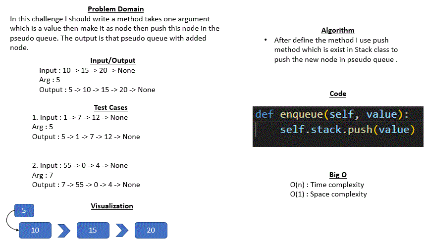
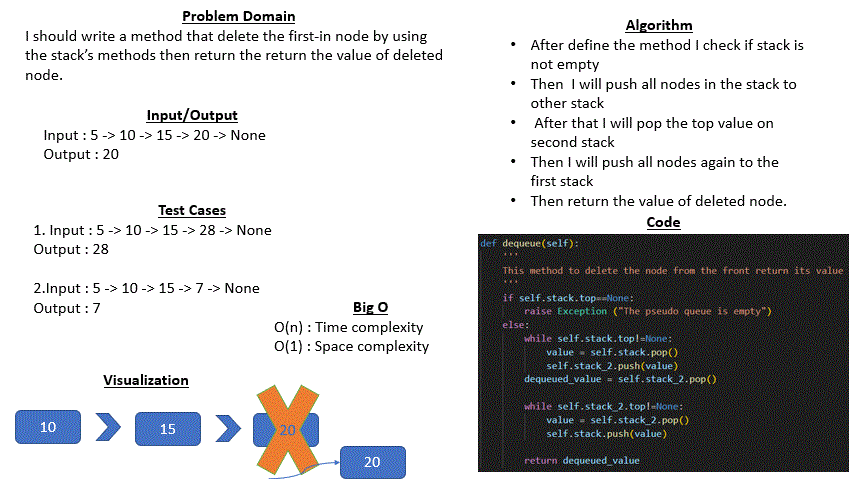

# Code Challenge 05 : stack-queue-pseudo
## Whiteboard Process
* ### enqueue method
     

* ### dequeue method
     

## Approach & Efficiency (for all methods)
* In this code I used a while loop to traverse to each node and if statement to make a specific conditions

* Big O for all methods:
    - O (n): Time complexity
    - O (1): Space complexity

## Solution 
Example (for enqueue method) : 
Input : 10 -> 15 -> 20 -> None 
Arg : 5  
Output : 5 -> 10 -> 15 -> 20 -> None

Example (for dequeue method) :  
Input : 5 -> 10 -> 15 -> 20 -> None 
Output : 20

