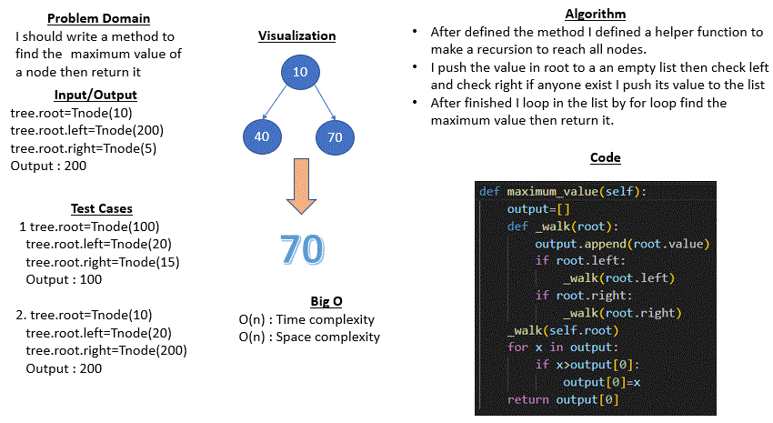

# Code challenge 16 : tree-max

## Whiteboard Process
* ### Maximum value
     

## Approach & Efficiency
* In this I did not take a lot of time, I just take a time when I try to return the maximum value.
* In this challenge I reached to all nodes by recursion and push all value of them in list then I looped in a list by for loop to find the maximum value 
* Big O: space complexity = O(n)
* Big O: time complexity = O(n)

## Solution
* 

    tree=BinaryTree()
    tree.root=Tnode(10)
    tree.root.left=Tnode(200)
    tree.root.right=Tnode(5)
    tree.root.left.left=Tnode(3000)
    tree.root.left.right=Tnode(40000)
    tree.root.right.left=Tnode(600000)

    Output : tree.maximum_value() : 600000

